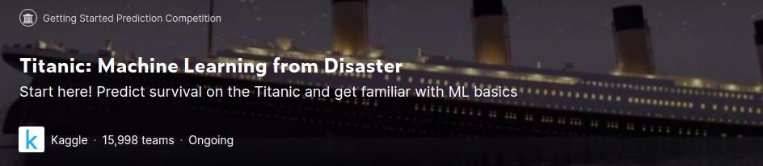
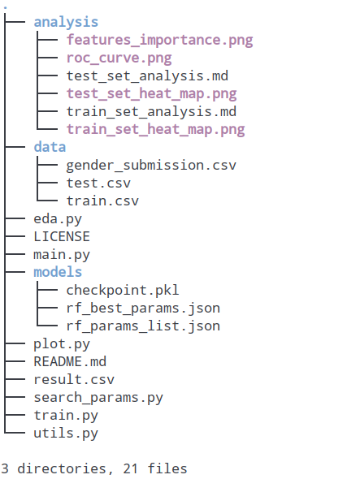
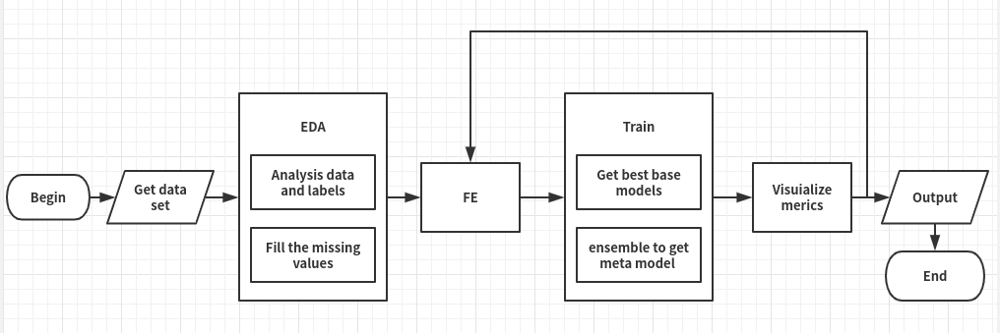
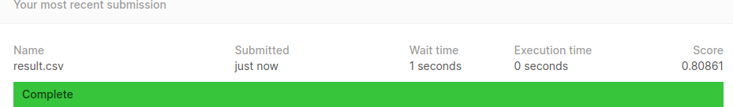

# kaggle-titanic-over-80-percent

## Introduction



A lot of people start their data scientist career through kaggle's "Hello World" level competition——Titanic. By reading notebooks from others, they can simply get a very high rank in leader board. But the notebook is only for presentation. When we are doing machine learning engineer, how can we orgnize our project. This repo is not only a tutorial, but also a template for similar machine learning works. (Notice I didn't use any magic feature that was mentioned by former competitors.)

Before you start your reading journey, here is one important thing you need to remember: directly copy other's result without thinking is shameful. You'd better try by yourself.


## Project structure



Let me explain some folders and files in this project:

1. **./analysis**: Store data's features and machine learning results.
2. **./data:** Data download from kaggle's download page.
3. **./models**: All models's hyper parameters and base model(after model ensembling)'s parameters, which is called checkpoint.pkl in this project.
4. **eda.py**:  Independent file which is responsible for exploratory data analysis.
5. **search_params.py:** Search all model we used here's best hyper parameters and do model ensemble.
6. **main.py:** Do all machine learning's procedure with result by eda's presentation  and model give by ead.py
7. **result.csv**: Generated from main.py. It's our target.

As for other files, such as **plot.py** and **train.py**, are part of our main.py. You can open the files in editor to see more details.


## Build

If you only want to get 80% percent score, the result is already saved in the "result.csv" file.

If you really want to run this script for some other reasons, you can do as follows:

We recommend using python3 and a virtual env. See instructions here.

```bash
virtualenv -p python3 .env
source .env/bin/activate
pip install -r requirements.txt
```

When you're done working on the project, deactivate the virtual environment with deactivate.

Next I'd like to introduce the standard machine learning procedure for myself:



The procedure is clearly shown by the upper image. Now let me explain how to follow this procedure:

1. Execute eda.py:

```bash
python eda.py
```

​	you will see the data features are already convert into markdown and png files in the ./analysis folder.

	2. Do feature engineering. Which is saved in main.py.
 	3. Execute search_params.py:

```bash
python search_params.py
```

​	you will get the best meta models and base model after ensembling.

	4. Execute main.py:

```bash
python main.py
```

​	you will see the machine learning result. And if you're not satisfied with this result. You can go back to step 2 to do further feature engineering.

	5. Submit your result in kaggle. See more details on kaggle's tutorial. Remember your submission file is **result.csv**



(P.S. you may find that in my rf_params_list.json file, there are no parameters that allow you to search. This is because the cv result don't actually behalf the test set. It's well known that competitions like this is a so-called overfitting problems. You can do whatever to improve your LB score without considering the bahavior in the reality. If you want to get a high rank in this competition, just keep this file.)

## Advanced 

I mentionde before that this project is also a template that you can adjust it to fit your real requirements. How can you make that?

There are a lot of things you can do for this project. For instance:

1. Add command line parser to deal with input and output.

2. Add more classifiers to get a stronger model that can get a better score.

3. Do futher feature engineering like add magic features that mentioned in some high rank competitors' notebooks.

   ...

## Reference

[1].Titanic Data Science Solutions from Manav Sehgal:

 https://www.kaggle.com/arthurtok/introduction-to-ensembling-stacking-in-python

[2].Introduction to Ensembling/Stacking in Python from Anisotropic:

 https://www.kaggle.com/arthurtok/introduction-to-ensembling-stacking-in-python

[3]. Titanic - Advanced Feature Engineering Tutorial from Gunes Evitan: 

https://www.kaggle.com/gunesevitan/titanic-advanced-feature-engineering-tutorial/comments